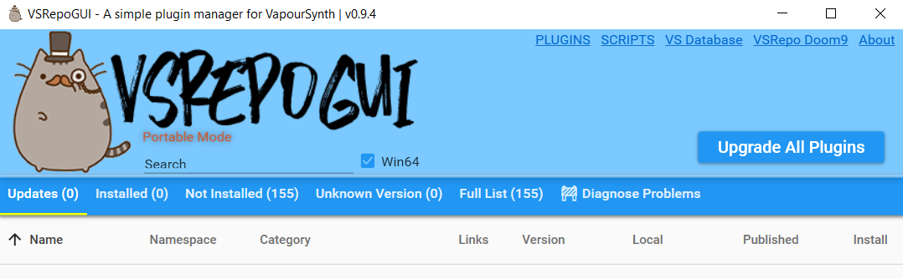
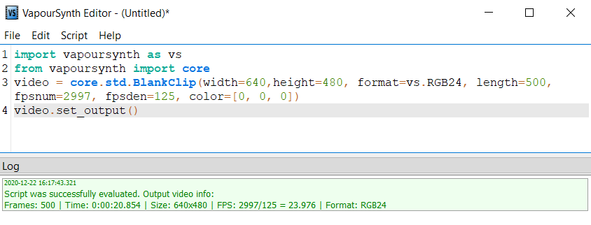

# Installation & Setup

This repo only provides an **overlay** to the already-impressive software built around VapourSynth. To setup, we need to generate a giant code dump of all the source code and plugins.

Versions used (all extracted to `src/vapoursynth64`):

* [Python 3.8.7 (embedded)](https://www.python.org/downloads/release/python-387/)
    * Use the `Windows embeddable package (64-bit)` version
    * VapourSynth R52 seems to break on 3.9.x and 3.7.x (not sure about 3.6.x and 3.5.x)
* [VapourSynth Portable R52](https://github.com/vapoursynth/vapoursynth/releases) (I used the x64 version; x32 will probably work but I haven't tried)
* [VapourSynth Editor R19](https://forum.doom9.org/showthread.php?t=170965)
* [VSRepo GUI v. 0.9.5](https://github.com/theChaosCoder/VSRepoGUI/releases)
* PyQt5 v. 5.12 (archive located under `resources` directory)

## 1. Make the Source Directory

If you downloaded this repo correctly, there should be a `src/vapoursynth` directory where the only things in it are:

* `tcl` (directory)
* `tkinter` (directory)
* `_tkinter`
* `tcl86t.dll`
* `tk86t.dll`
* `vsrepogui.json`

You need to download the resources listed above and extract them all into this directory. I would suggest doing it in the order the sources are listed; if a preceding extraction complains that a certain file is already there, allow the overlay to **override** the existing base.

Also make sure you are downloading the embedded/portable versions; otherwise you may be forced to install a lot of other stuff. And if you're a coder like me that could potentially really mess up your environment. The Python version probably doesn't really matter as long as its >= 3.5 but you may as well download the latest one. As far as I know there shouldn't be breaking changes between versions for what we're doing (e.g. no walrus operators here).

## 2. Verify the Installation

A quick way to verify the (portable) installation is to make sure that the executables are functioning. Make sure the following work without complaints:

* `VSRepoGUI.exe` (has a pusheen icon): This is used to download plugins; we will be using more of this later. Just make sure this opens without error.



* `vsedit.exe` (has a vs icon): This is the VapourSynth editor; this is where VapourSynth code will actually get executed. Again, make sure this opens without error, but we also need to check VapourSynth (and `tkinter`, which is what my GUI uses) is configured properly. Copy and paste the following dummy script in, then go to `Script->Check Script`; the logs should report no errors.

```
import PyQt5 as pyqt # this is actually unrelated to vapoursynth, this is for zero's gui :)
import vapoursynth as vs
from vapoursynth import core

video = core.std.BlankClip(width=640,height=480, format=vs.RGB24, length=500, fpsnum=2997, fpsden=125, color=[0, 0, 0])
video.set_output()
```



If both those work you're pretty much good to go!
